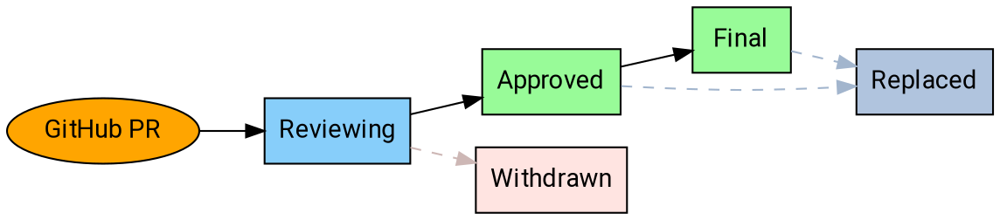

# AEP Purpose and Guidelines

Service APIs on the Internet continue to proliferate; having a machine-readable
API is an expectation and prerequisite to adoption for many services. By some
estimates, there are now more than 20,000 public REST APIs available.

As this corpus continues to grow, many companies struggle with API Governance:
even as companies grow and disparate teams work to deliver discrete services,
APIs ought to remain simple, intuitive, and consistent.

Therefore, it is increasingly necessary to have a corpus of documentation for
API producers, reviewers, and other interested parties to reference. The AEP
collection provides a way to provide consistent documentation for API design
guidance.

## What is an AEP?

AEP stands for **API Enhancement Proposal**, which is a design document
providing high-level, concise documentation for API development.

Companies that adopt the AEP program use them as a source of truth for
API-related documentation, and the means by which service producers discuss and
come to consensus on API guidance. AEPs are maintained as Markdown files with
metadata in the AEP GitHub repository.

## Adopting AEPs

Companies **may** adopt the AEP system in one of two ways:

- By applying the guidance described at [aip.dev][].
- By "forking" the AEP system and setting up their own subdomain.

Companies with an already-established corpus of services are unlikely to have
exactly followed the guidance at [aip.dev][]. Forking the system is valuable
because the guidance becomes comparable. Forks **must** retain the same
numbering system (AEP-2) to provide that comparability.

### Technical leadership

The AEP system, as well as the guidance on [aip.dev][], is overseen by the AEP
technical steering committee. The committee is the set of people who make
decisions on AEPs. The general goal is that the AEP process is collaborative
and that we largely work on the basis of consensus. However, a limited number
of designated approvers is necessary, and these committee members will be
approvers for each AEP on [aip.dev][].

The technical steering committee membership is currently:

- Antoine Boyer (@tinnou), Netflix
- Ross Hamilton (@rhamiltonsf), Salesforce
- Mike Kistler (@mkistler), IBM
- Luke Sneeringer (@lukesneeringer), Google

The committee is also responsible for the administrative and editorial aspects
of shepherding AEPs and managing the AEP pipeline and workflow. They approve
PRs to AEPs, assign proposal numbers, manage the agenda, set AEP states, and so
forth. They also ensure that AEPs are readable (proper spelling, grammar,
sentence structure, markup, etc.).

Committee membership is by invitation of the current committee. The committee
**must not** include more than two members from the same company.

**Note:** Companies that maintain their own fork of [aip.dev][] select their
own leadership and have full control of their fork's content.

## States

At any given time, AEPs may exist in a variety of states as they work their way
through the process. The following is a summary of each state.

### Reviewing

Initial discussion on most AEPs occurs in the initial pull request to submit
the AEP. Once this PR is merged, the AEP exists in the "Reviewing" state. This
means that the authors and the technical steering committee have reached a
general consensus on the proposal.

At this stage, the committee may request changes or suggest alternatives to the
proposal before moving forward, but there is a general expectation that the
proposal will move forward and it is usually safe to "early adopt" it.

An AEP **must** be in the reviewing state for at least 14 days before being
approved, and the committee **should** send appropriate communication regarding
the pending approval.

**Note:** As a formal matter, one AEP approver (other than the author) **must**
provide formal signoff to advance an AEP to the reviewing state. Additionally,
there **must not** be formal objections ("changes requested" on the GitHub PR)
from other approvers.

### Approved

Once an AEP has been agreed upon, it enters "approved" state and is considered
"best current practice".

AEPs **may** be edited after they are approved, either to correct grammar or
word choices, or to clarify semantic guidance (in response to reader
questions). In rare occasions, new guidance **may** be added.

Clarifications and new guidance **must** be reflected in the changelog.
Correction of typos or minor language alterations **may** be done silently.

**Note:** As a formal matter, two AEP approvers (other than the author)
**must** provide formal signoff to advance an AEP to the approved state.
Additionally, there **must not** be formal objections ("changes requested" on
the GitHub PR) from other approvers.

### Final

If an AEP has been approved for a significant period and the technical steering
committee is certain that no further guidance will be needed, they **may** move
the AEP in to "final" state.

AEPs in the final state **must not** be amended with new guidance. They **may**
be editied to correct spelling, grammar, or clarity provided there are no
semantic changes.

**Note:** As a formal matter, two AEP approvers **must** provide formal signoff
to advance an AEP to the final state. Additionally, there **must not** be
formal objections ("changes requested" on the GItHub PR) from other approvers.

### Replaced

If an AEP has been replaced by another AEP, it enters "replaced" state. The AEP
**must** include a notice explaining the replacement and rationale (the
replacement AEP **should** also clearly explain the rationale).

In general, service producers rely primarily on AEPs in the "approved" state.
Service producers **may** rely on AEPs in the "reviewing" state

### Withdrawn

If an AEP is withdrawn by the author or champion, or is rejected by the
technical steering committee after reaching the "reviewing" state, it enters
"withdrawn" state. Withdrawn AEPs remain accessible, but are removed from the
indexes; they provide documentation and reference to inform future discussions.

## Workflow

The following workflow describes the process for proposing an AEP, and moving
an AEP from proposal to implementation to final acceptance.

### Overview

### Proposing an AEP

In order to propose an AEP, first open a pull request with a draft AEP; the AEP
should conform to the guidance in AEP-8. Most AEPs **should** be no more than
two pages if printed out.

If the technical steering committee has suggested an AEP number, use that;
otherwise use 99 (and expect to change it during the course of the review).

**Important:** Ensure that the PR is editable by maintainers.

In most circumstances, the committee will assign the proposal an AEP number and
begin discussion. Once there is consensus, the committee will merge the PR, and
the AEP will enter the "reviewing" state.

The committee **may** reject an AEP outright if they have an obvious reason to
do so (e.g. the proposal was already discussed and rejected in another AEP or
is fundamentally unsound), in which case the PR is not merged.

### Accepting an AEP

The editors will work together to ensure that qualified proposals do not linger
in review.

To gain final approval, an AEP **must** be approved by, at minimum, two members
of the technical steering committee. Additionally, there **should not** be any
committee members requesting significant changes (indicated by the use of the
"changes requested" feature on GitHub).

**Note:** If an AEP editor is the primary author of an AEP, then at least two
_other_ editors must approve it.

### Withdrawing or Rejecting an AEP

The author of an AEP may decide, after further consideration, that an AEP
should not advance. If so, the author may withdraw the AEP by updating the PR
adding a notice of withdrawal with an explanation of the rationale.

Additionally, the author may be unable to get consensus among the group and the
technical steering committee may elect to reject the AEP. In this situation,
the committee shall amend the PR adding a notice of rejection with an
explanation of the rationale. In both cases, the committee **must** update the
state accordingly and submit the PR.

### Replacing an AEP

In rare cases, it may be necessary to replace an AEP with another one. This is
not general practice: minor edits to approved AEPs are acceptable, and AEPs
only enter final state when there is high confidence that further edits will
not be necessary.

However, if new guidance fundamentally alters the old guidance in some way,
then the technical steering committee **should** create a new AEP that, once
approved, will replace the old one. The old one then enters "Replaced" state,
and will link to the new, current AEP.

[aip.dev]: https://aip.dev/
