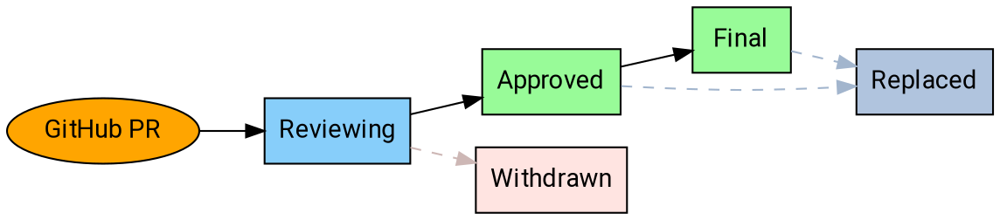

# AIP Purpose and Guidelines

An API standard is a collection of rules, guidance, and patterns that will help
an API Designer achieve a certain degree of consistency and quality in the API
being written. A well defined standard – when followed – can improve a system’s
overall performance, availability, security, and developer experience.

However, many companies struggle with API Governance. This is in part because
there is no golden solution for creating an API. There are a myriad of API
methodologies, programming languages, transport protocols, interface design
languages, architectural styles and serialization techniques which have been
used in the creation of successful APIs. As of yet, there is no golden
combination of these attributes that has been able to satisfy all cost,
performance, quality, and functional concerns of every system.

Despite this diversity, there is one consistency that will surface once all the
variables in an API implementation have been decided; API designers,
developers, and consumers will want to standardize.

Just as there is no golden API implementation, as of yet there is also no
golden API standard. However, there are a number of cross cutting concerns that
should be addressed in each API standard.

The purpose of aip.dev is to provide the infrastructure and patterns for
defining API Standards. The cross cutting concerns that should be defined in an
API standard are enumerated into AIPs. This helps remind standard writers of
the topics which need to be defined for their standard. It also enables
standars to be compared or referenced easily. When an organization writes their
standard for pagination (AIP 158), they may choose to write their own, or they
may choose to reference or extend an AIP 158 written by another organization.
For the API developer they know that concerning pagination they only need to
refer to their organization's definition of AIP 158.

## What is an AIP?

AIP stands for **API Improvement Proposal**, which is a design document
providing high-level, concise documentation for API development.

Companies that adopt the AIP program use them as a source of truth for
API-related documentation, and the means by which service producers discuss and
come to consensus on API guidance. AIPs are maintained as Markdown files with
metadata in the AIP GitHub repository.

## Adopting AIPs

Companies **may** adopt the AIP system in one of two ways:

- By applying the guidance described at [aip.dev][].
- By "forking" the AIP system and setting up their own subdomain.

Companies with an already-established corpus of services are unlikely to have
exactly followed the guidance at [aip.dev][]. Forking the system is valuable
because the guidance becomes comparable. Forks **must** retain the same
numbering system (AIP-2) to provide that comparability.

### Technical leadership

The AIP system, as well as the guidance on [aip.dev][], is overseen by the AIP
technical steering committee. The committee is the set of people who make
decisions on AIPs. The general goal is that the AIP process is collaborative
and that we largely work on the basis of consensus. However, a limited number
of designated approvers is necessary, and these committee members will be
approvers for each AIP on [aip.dev][].

The technical steering committee membership is currently:

- Sam Woodard (@shwoodard), Google
- Ross Hamilton (@hamilton-dfp), DeepSee
- Mike Kistler (@mkistler), Microsoft
- Luke Sneeringer (@lukesneeringer)

The committee is also responsible for the administrative and editorial aspects
of shepherding AIPs and managing the AIP pipeline and workflow. They approve
PRs to AIPs, assign proposal numbers, manage the agenda, set AIP states, and so
forth. They also ensure that AIPs are readable (proper spelling, grammar,
sentence structure, markup, etc.).

Committee membership is by invitation of the current committee. The committee
**must not** include more than two members from the same company.

**Note:** Companies that maintain their own fork of [aip.dev][] select their
own leadership and have full control of their fork's content.

## States

At any given time, AIPs may exist in a variety of states as they work their way
through the process. The following is a summary of each state.

### Reviewing

Initial discussion on most AIPs occurs in the initial pull request to submit
the AIP. Once this PR is merged, the AIP exists in the "Reviewing" state. This
means that the authors and the technical steering committee have reached a
general consensus on the proposal.

At this stage, the committee may request changes or suggest alternatives to the
proposal before moving forward, but there is a general expectation that the
proposal will move forward and it is usually safe to "early adopt" it.

An AIP **must** be in the reviewing state for at least 14 days before being
approved, and the committee **should** send appropriate communication regarding
the pending approval.

**Note:** As a formal matter, one AIP approver (other than the author) **must**
provide formal signoff to advance an AIP to the reviewing state. Additionally,
there **must not** be formal objections ("changes requested" on the GitHub PR)
from other approvers.

### Approved

Once an AIP has been agreed upon, it enters "approved" state and is considered
"best current practice".

AIPs **may** be edited after they are approved, either to correct grammar or
word choices, or to clarify semantic guidance (in response to reader
questions). In rare occasions, new guidance **may** be added.

Clarifications and new guidance **must** be reflected in the changelog.
Correction of typos or minor language alterations **may** be done silently.

**Note:** As a formal matter, two AIP approvers (other than the author)
**must** provide formal signoff to advance an AIP to the approved state.
Additionally, there **must not** be formal objections ("changes requested" on
the GitHub PR) from other approvers.

### Final

If an AIP has been approved for a significant period and the technical steering
committee is certain that no further guidance will be needed, they **may** move
the AIP in to "final" state.

AIPs in the final state **must not** be amended with new guidance. They **may**
be editied to correct spelling, grammar, or clarity provided there are no
semantic changes.

**Note:** As a formal matter, two AIP approvers **must** provide formal signoff
to advance an AIP to the final state. Additionally, there **must not** be
formal objections ("changes requested" on the GItHub PR) from other approvers.

### Replaced

If an AIP has been replaced by another AIP, it enters "replaced" state. The AIP
**must** include a notice explaining the replacement and rationale (the
replacement AIP **should** also clearly explain the rationale).

In general, service producers rely primarily on AIPs in the "approved" state.
Service producers **may** rely on AIPs in the "reviewing" state

### Withdrawn

If an AIP is withdrawn by the author or champion, or is rejected by the
technical steering committee after reaching the "reviewing" state, it enters
"withdrawn" state. Withdrawn AIPs remain accessible, but are removed from the
indexes; they provide documentation and reference to inform future discussions.

## Workflow

The following workflow describes the process for proposing an AIP, and moving
an AIP from proposal to implementation to final acceptance.

### Overview

### Proposing an AIP

In order to propose an AIP, first open a pull request with a draft AIP; the AIP
should conform to the guidance in AIP-8. Most AIPs **should** be no more than
two pages if printed out.

If the technical steering committee has suggested an AIP number, use that;
otherwise use 99 (and expect to change it during the course of the review).

**Important:** Ensure that the PR is editable by maintainers.

In most circumstances, the committee will assign the proposal an AIP number and
begin discussion. Once there is consensus, the committee will merge the PR, and
the AIP will enter the "reviewing" state.

The committee **may** reject an AIP outright if they have an obvious reason to
do so (e.g. the proposal was already discussed and rejected in another AIP or
is fundamentally unsound), in which case the PR is not merged.

### Accepting an AIP

The editors will work together to ensure that qualified proposals do not linger
in review.

To gain final approval, an AIP **must** be approved by, at minimum, two members
of the technical steering committee. Additionally, there **should not** be any
committee members requesting significant changes (indicated by the use of the
"changes requested" feature on GitHub).

**Note:** If an AIP editor is the primary author of an AIP, then at least two
_other_ editors must approve it.

### Withdrawing or Rejecting an AIP

The author of an AIP may decide, after further consideration, that an AIP
should not advance. If so, the author may withdraw the AIP by updating the PR
adding a notice of withdrawal with an explanation of the rationale.

Additionally, the author may be unable to get consensus among the group and the
technical steering committee may elect to reject the AIP. In this situation,
the committee shall amend the PR adding a notice of rejection with an
explanation of the rationale. In both cases, the committee **must** update the
state accordingly and submit the PR.

### Replacing an AIP

In rare cases, it may be necessary to replace an AIP with another one. This is
not general practice: minor edits to approved AIPs are acceptable, and AIPs
only enter final state when there is high confidence that further edits will
not be necessary.

However, if new guidance fundamentally alters the old guidance in some way,
then the technical steering committee **should** create a new AIP that, once
approved, will replace the old one. The old one then enters "Replaced" state,
and will link to the new, current AIP.

[aip.dev]: https://aip.dev/
[api design patterns]: https://www.manning.com/books/api-design-patterns
